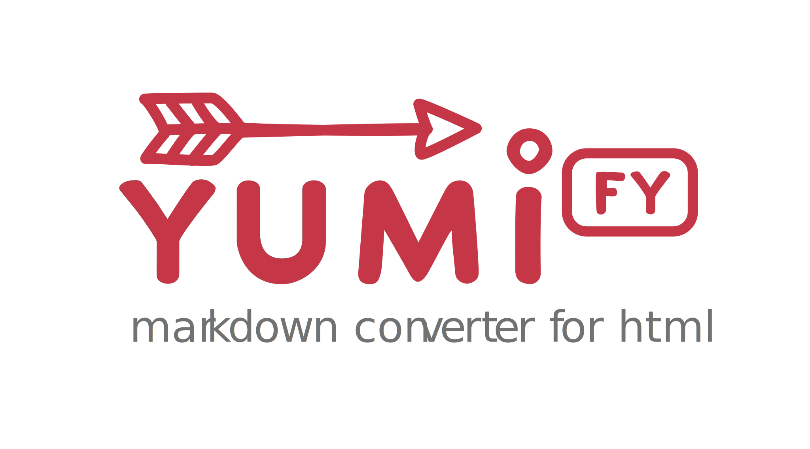

<div align="center">
	
	<br>
	<p>A light-weight HTML to Markdown converter in javascript</p>
	<a href="https://github.com/atypo/yumify/actions"></a>
</div>

---

## Description

Yumify is a port of Markdownify from python, a HTML to markdown converter and has the same settings more or less!

In Japanese, "Yumi" can mean "archery" or "bow," symbolizing precision and transformation, much like converting HTML to Markdown. Plus, it's short and cute!

## Usage

```typescript
import { yumi } from 'atypo/yumify';

const html = `
<h1>Welcome to Yumify</h1>
<p>This is an example of converting <strong>HTML</strong> to Markdown using <em>Yumi</em>.</p>
<h4>Shopping List</h4>
<ul>
    <li>Carrot</li>
    <li>Parrot</li>
    <li>Apple</li>
    <li>Brownie</li>
    <li>Sandwitch</li>
<ul>
<br/>
<h4>News</h4>
<p>The name of the <i>game<i> is <em>Yumi</em> and So is <strong>this</strong> and <b>that</b></p>
`;

const markdown = yumi(html, { bullets: '-', autolinks: false });
console.log(markdown);
# Welcome to Yumify

This is an example of converting **HTML** to Markdown using _Yumi_.

#### Shopping List

- Carrot
- Parrot
- Apple
- Brownie
- Sandwitch

#### News

The name of the *game *is _Yumi_ and So is **this** and **that**
```

**h1** and **h2** will have a different styling, to have them follow `#` styling add option `headingStyle` to empty string `''`

```typescript
const markdown = yumify.yumi(html, { headingStyle: '' });
console.log(markdown);

# Im a H1 Tag
## Im a H2 Tag
```

## Options available

| Option                 | Description                                                                                                                                                             | Default             |
| ---------------------- | ----------------------------------------------------------------------------------------------------------------------------------------------------------------------- | ------------------- |
| `strip`                | A list of tags to strip. This option can't be used with the `convert` option.                                                                                           | `[]`                |
| `convert`              | A list of tags to convert. This option can't be used with the `strip` option.                                                                                           | `[]`                |
| `autolinks`            | A boolean indicating whether the "automatic link" style should be used when a tag's contents match its href.                                                            | `true`              |
| `defaultTitle`         | A boolean to enable setting the title of a link to its href, if no title is given.                                                                                      | `false`             |
| `headingStyle`         | Defines how headings should be converted. Accepted values are `atx_closed`, and `underlined`. Defaults to `underlined`.                                                 | `underlined`        |
| `bullets`              | An iterable (string, list, or tuple) of bullet styles to be used. Defaults to `*+-`.                                                                                    | `*+-`               |
| `strongEmSymbol`       | In Markdown, both `*` and `_` are used to encode strong or emphasized texts. Either of these symbols can be chosen by the options `asterisk` (default) or `underscore`. | `asterisk`          |
| `subSymbol`            | Define the chars that surround `<sub>` text.                                                                                                                            | `''` (empty string) |
| `supSymbol`            | Define the chars that surround `<sup>` text.                                                                                                                            | `''` (empty string) |
| `newlineStyle`         | Defines the style of marking line breaks (`<br>`) in Markdown. Accepted values are `spaces` and `backslash`. Defaults to `spaces`.                                      | `spaces`            |
| `codeLanguage`         | Defines the language that should be assumed for all `<pre>` sections. Defaults to `''` (empty string). Can be any string.                                               | `''` (empty string) |
| `codeLanguageCallback` | Defines a callback function to dynamically determine the code language for each `<pre>` section.                                                                        | `undefined`         |
| `escapeAsterisks`      | If set to `false`, do not escape `*` to `\*` in text.                                                                                                                   | `true`              |
| `escapeUnderscores`    | If set to `false`, do not escape `_` to `\_` in text.                                                                                                                   | `true`              |
| `escapeMisc`           | If set to `false`, do not escape miscellaneous punctuation characters that sometimes have Markdown significance in text.                                                | `true`              |
| `keepInlineImagesIn`   | A list of parent tags that should be allowed to contain inline images.                                                                                                  | `[]`                |
| `wrap`                 | If set to `true`, all text paragraphs are wrapped at `wrapWidth` characters.                                                                                            | `false`             |
| `wrapWidth`            | The number of characters at which text paragraphs are wrapped if `wrap` is set to `true`.                                                                               | `80`                |

... and thats that about that!
